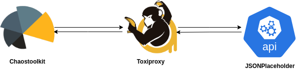

# README: Menyisipkan Toxiproxy antara ChaosToolkit dan JSONPlaceholder API

Dokumen ini menjelaskan alur (flow) pemasangan **Toxiproxy** sebagai proxy di antara **ChaosToolkit** dan **JSONPlaceholder API** untuk keperluan eksperimen chaos engineering.

## Tujuan

Dengan menempatkan Toxiproxy di antara ChaosToolkit dan API target, kita dapat menyuntikkan gangguan (toxic) seperti latency, timeout, packet loss, bandwidth limit, dan lain-lain, untuk menguji ketahanan sistem terhadap kondisi jaringan yang tidak ideal.

## Arsitektur

**Gambar:** Arsitektur pemasangan Toxiproxy sebagai perantara antara ChaosToolkit dan JSONPlaceholder API.

- ChaosToolkit mengirimkan request HTTP ke endpoint API.
- Request tersebut diarahkan ke Toxiproxy (berjalan sebagai container/service terpisah).
- Toxiproxy dapat menyuntikkan berbagai gangguan jaringan (toxic) sesuai skenario eksperimen.
- Setelah melalui Toxiproxy, request diteruskan ke JSONPlaceholder API.
- Response dari API juga melewati Toxiproxy sebelum kembali ke ChaosToolkit.

Dengan arsitektur ini, setiap eksperimen dapat mengontrol dan mengamati efek gangguan jaringan secara terisolasi dan terukur.

## Daftar Eksperimen

Berikut adalah referensi ke seluruh file eksperimen pada folder ini:

- [01.01-simple-hit-dummy-api.json](01.01-simple-hit-dummy-api.json): Melakukan request sederhana ke endpoint dummy API tanpa proxy.
- [01.02-add-proxy-and-hit-dummy-api.json](01.02-add-proxy-and-hit-dummy-api.json): Menambahkan proxy Toxiproxy dan melakukan request ke dummy API melalui proxy.
- [01.03-add-toxic-latency.json](01.03-add-toxic-latency.json): Menyuntikkan toxic latency untuk mensimulasikan keterlambatan jaringan.
- [01.04-add-toxic-bandwidth-degradation.json](01.04-add-toxic-bandwidth-degradation.json): Menyuntikkan toxic bandwidth untuk mensimulasikan penurunan bandwidth.
- [01.05-add-toxic-slow-connection-close.json](01.05-add-toxic-slow-connection-close.json): Menyuntikkan toxic slow_close untuk mensimulasikan penutupan koneksi yang lambat.
- [01.06-add-toxic-timeout.json](01.06-add-toxic-timeout.json): Menyuntikkan toxic timeout untuk mensimulasikan timeout koneksi.
- [01.07-add-toxic-slicer.json](01.07-add-toxic-slicer.json): Menyuntikkan toxic slicer untuk mensimulasikan pemotongan paket data.
- [01.08-add-toxic-limiter.json](01.08-add-toxic-limiter.json): Menyuntikkan toxic limiter untuk mensimulasikan pembatasan data saat downstream.

Setiap file di atas berisi skenario eksperimen chaos engineering yang berbeda menggunakan Toxiproxy dan dapat dijalankan secara terpisah menggunakan ChaosToolkit.

