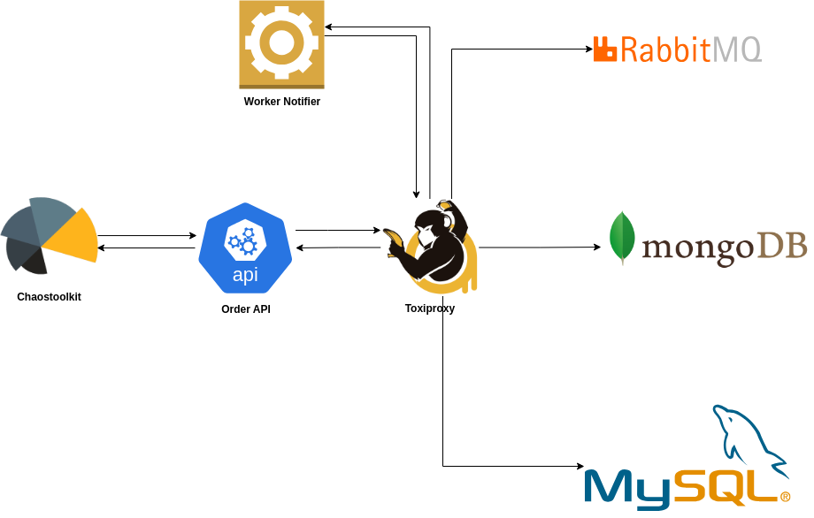

# ChaosMicro — Toxiproxy di antara ChaosToolkit & Microservices

Dokumen ini menjelaskan alur pemasangan **Toxiproxy** sebagai proxy di antara **ChaosToolkit** dan dependency **microservices** pada project **ChaosMicro** untuk kebutuhan eksperimen _chaos engineering_.

## Tujuan

Dengan menempatkan Toxiproxy di jalur komunikasi antara service dan dependency (database/broker), kita bisa menyuntikkan gangguan jaringan (_toxic_) seperti **latency**, **timeout**, **packet slicing**, **bandwidth limit**, dan **byte limiter**. Tujuannya adalah mengukur ketahanan service terhadap kondisi jaringan yang tidak ideal, serta memvalidasi fallback/retry dan observabilitas.

## Arsitektur



**Gambar:** Toxiproxy ditempatkan di antara **service** (mis. `order-api`) dan **MySQL** (serta dependency lain yang relevan). ChaosToolkit mengorkestrasi eksperimen: membuat proxy/menambah toxic → memanggil endpoint service → mengevaluasi hasil.  

- ChaosToolkit menjalankan eksperimen (probe + action).
- Request service (mis. insert order) melewati **Toxiproxy** terlebih dahulu.
- Toxiproxy menyuntikkan gangguan (toxic) sesuai skenario.
- Service berinteraksi dengan dependency (contoh: **MySQL**) melalui proxy tersebut.
- Hasil/efek gangguan diamati melalui probe dan metrik.

## Daftar Eksperimen

Folder ini berisi eksperimen yang berfokus pada **dependency MySQL** (`mysql_proxy`). Setiap file dapat dijalankan terpisah menggunakan ChaosToolkit.

- **[02.01-add-toxiproxy.json](02.01-add-toxiproxy.json)**  
  Membuat/memastikan **proxy Toxiproxy** aktif untuk MySQL (`mysql_proxy`) dan memverifikasi _baseline_ (tanpa toxic).

- **[02.02-add-mysql-toxic-latency.json](02.02-add-mysql-toxic-latency.json)**  
  Menyuntikkan **toxic _latency_** pada `mysql_proxy` untuk mensimulasikan keterlambatan jaringan (dengan jitter opsional).

- **[02.03-add-mysql-toxic-bandwidth-degradation.json](02.03-add-mysql-toxic-bandwidth-degradation.json)**  
  Menyuntikkan **toxic _bandwidth_** untuk membatasi laju transfer data (kb/s) dari/ke MySQL.

- **[02.04-add-mysql-toxic-timeout.json](02.04-add-mysql-toxic-timeout.json)**  
  Menyuntikkan **toxic _timeout_** untuk mensimulasikan operasi yang menunggu terlalu lama (request mungkin gagal karena time out).

- **[02.05-add-mysql-toxic-slow-close.json](02.05-add-mysql-toxic-slow-close.json)**  
  Menyuntikkan **toxic _slow_close_** untuk menunda penutupan koneksi, menguji ketahanan koneksi yang “menggantung”.

- **[02.06-add-mysql-toxic-slicer.json](02.06-add-mysql-toxic-slicer.json)**  
  Menyuntikkan **toxic _slicer_** (pemecahan paket) untuk melihat dampak fragmentasi paket data pada jalur MySQL.

- **[02.07-add-mysql-toxic-limiter.json](02.07-add-mysql-toxic-limiter.json)**  
  Menyuntikkan **toxic _limiter_** (batas total byte) untuk memotong payload/stream melebihi ambang tertentu.

> **Catatan:** Pola yang sama dapat diperluas ke dependency lain (mis. **MongoDB** dan **RabbitMQ**) dengan membuat proxy (`mongo_proxy`, `rabbitmq_proxy`) dan menyesuaikan file eksperimen.

## Menjalankan Eksperimen

1. Pastikan **ChaosToolkit** dan plugin **chaostoxi (chaostoolkit-toxiproxy)** sudah terpasang.
2. Pastikan **Toxiproxy server** berjalan dan **proxy `mysql_proxy`** tersedia (dibuat otomatis oleh stack atau via seed).
3. Jalankan salah satu eksperimen:
   ```bash
   chaos run 02.02-add-mysql-toxic-latency.json
   ```
4. (Opsional) Pastikan _rollback_ selalu dieksekusi meski eksperimen gagal:
   ```json
   {
     "runtime": { "rollbacks": { "strategy": "always" } }
   }
   ```
   …atau jalankan dengan flag:
   ```bash
   chaos run --rollback-strategy=always 02.02-add-mysql-toxic-latency.json
   ```

Dengan dokumentasi ini, Anda dapat memilih skenario toxic yang diinginkan dan menjalankannya secara terisolasi untuk menguji ketahanan microservices pada project **ChaosMicro**.

## Membuat Report Eksperimen ChaosToolkit

Setelah menjalankan eksperimen, Anda dapat menghasilkan report otomatis (PDF/HTML/Markdown) dari hasil eksekusi:

1. Jalankan eksperimen dan simpan hasil _journal_:
   ```bash
   chaos run 02.02-add-mysql-toxic-latency.json --journal-path=02.02.json
   ```
2. Generate report dari _journal_ tersebut, misal ke PDF:
   ```bash
   chaos report --export-format=pdf 02.02.json 02.02.pdf
   ```
   Atau ke HTML/Markdown:
   ```bash
   chaos report --export-format=html 02.02.json 02.02.html
   chaos report --export-format=markdown 02.02.json 02.02.md
   ```

Ganti nama file sesuai skenario yang dijalankan. Report ini dapat digunakan untuk dokumentasi, audit, atau presentasi hasil eksperimen resiliency.

### Analisa Hasil Chaos Engineering (MySQL + Toxiproxy)

Berikut adalah analisis dari beberapa skenario chaos engineering yang dilakukan terhadap layanan `order-api` dan `notifier` dengan menggunakan **chaostoxi** untuk menyuntikkan berbagai jenis *toxic* pada koneksi MySQL.

---

## 1. Latency Toxic
- **Skenario**: Menambahkan *latency toxic* dengan delay `5000 ms` dan jitter `2000 ms`.
- **Hasil**:
  - Health check `order-api` dan `notifier` tetap **200 OK** (steady state terpenuhi).
  - Saat melakukan POST order, request tetap berhasil (`201 Created`), namun durasi meningkat drastis menjadi ~8,7 detik.
- **Analisa**:
  - Aplikasi masih **resilient** terhadap latensi tinggi, meski response time meningkat signifikan.
  - Tidak ada kegagalan fatal, namun potensi *timeout* dari sisi klien lain sangat mungkin jika limit timeout lebih ketat (< 8 detik).

---

## 2. Bandwidth Toxic
- **Skenario**: Menambahkan *bandwidth degradation toxic* dengan `rate = 1` (1 KB/s).
- **Hasil**:
  - Health check tetap **200 OK**.
  - POST order tetap berhasil (`201 Created`), hanya menambah sedikit delay (~0,18 detik).
- **Analisa**:
  - Karena payload MySQL query relatif kecil, degradasi bandwidth tidak berpengaruh signifikan.
  - Dampak akan terasa pada workload besar (misalnya bulk query / large dataset).

---

## 3. Timeout Toxic
- **Skenario**: Menambahkan *timeout toxic* dengan `5000 ms`.
- **Hasil**:
  - Health check tetap **200 OK**.
  - POST order gagal dengan **500 Internal Server Error** (`db insert err: invalid connection`).
- **Analisa**:
  - Aplikasi tidak mampu menolerir skenario *timeout*, koneksi dianggap invalid.
  - Ini menunjukkan kurangnya mekanisme retry atau fallback pada layer DB connection.

---

## 4. Slow Close Toxic
- **Skenario**: Menambahkan *slow_close toxic* dengan delay `5000 ms`.
- **Hasil**:
  - Health check tetap **200 OK**.
  - POST order berhasil (`201 Created`) dengan durasi normal (~37 ms).
- **Analisa**:
  - Slow close tidak berdampak signifikan pada request-response flow singkat.
  - Namun potensi masalah bisa muncul jika ada *connection pooling* dengan frekuensi tinggi close/open, bisa menyebabkan resource leak atau exhaustion.

---

## 5. Slicer Toxic
- **Skenario**: Menambahkan *slicer toxic* (`average_size = 32`, `size_variation = 16`).
- **Hasil**:
  - Health check tetap **200 OK**.
  - POST order berhasil (`201 Created`) dengan durasi rendah (~32 ms).
- **Analisa**:
  - Fragmentasi paket tidak mengganggu transaksi kecil.
  - Dampak lebih signifikan pada query panjang atau protokol yang lebih sensitif terhadap fragmentasi.

---

## 6. Limiter Toxic
- **Skenario**: Menambahkan *limiter toxic* (`bytes_limit = 1024`).
- **Hasil**:
  - Health check tetap **200 OK**.
  - POST order berhasil (`201 Created`) dengan durasi ~26 ms.
- **Analisa**:
  - Batasan 1KB masih cukup untuk query sederhana.
  - Namun query kompleks atau transaksi dengan banyak data kemungkinan akan gagal.

---

# 📌 Kesimpulan Umum
1. **Latency & Timeout** memberikan dampak paling jelas:
   - Latency → meningkatkan response time secara signifikan.
   - Timeout → menyebabkan kegagalan koneksi & error 500.
2. **Bandwidth, Slow Close, Slicer, Limiter** tidak menimbulkan gangguan besar untuk workload kecil.
3. **Resiliensi Aplikasi**:
   - Layanan tetap sehat selama eksperimen.
   - Namun error 500 pada skenario timeout menunjukkan perlunya **retry strategy** dan **circuit breaker**.

# 🛠️ Rekomendasi
- Tambahkan **retry + exponential backoff** pada koneksi DB.
- Gunakan **connection pool monitoring** untuk mendeteksi slow-close anomalies.
- Lakukan tes dengan workload besar agar bandwidth, limiter, dan slicer bisa menunjukkan dampak lebih nyata.
- Terapkan **alerting** pada latensi query > 5 detik agar bisa terdeteksi lebih cepat.

---

# Tabel Ringkas Hasil Chaos Engineering MySQL dengan Toxiproxy

| **Skenario Toxic** | **Dampak ke Health Check** | **Dampak ke Order API** | **Analisa** | **Rekomendasi** |
|---------------------|----------------------------|--------------------------|-------------|------------------|
| **Latency (5000ms + jitter 2000ms)** | Tetap **200 OK** | Order berhasil tapi lambat (~8.7s) | Aplikasi masih resilient, tapi latency tinggi bisa memicu timeout pada klien | Tambah monitoring latency query, implementasikan timeout & alerting |
| **Bandwidth (1 KB/s)** | Tetap **200 OK** | Order berhasil, delay kecil (~0.18s) | Query kecil tidak terpengaruh signifikan | Tes dengan workload besar untuk lihat dampak sesungguhnya |
| **Timeout (5000ms)** | Tetap **200 OK** | Order gagal → **500 Internal Server Error** | Aplikasi tidak tahan timeout, koneksi dianggap invalid | Tambah mekanisme retry, exponential backoff, circuit breaker |
| **Slow Close (5000ms)** | Tetap **200 OK** | Order berhasil (~37ms) | Tidak berdampak signifikan untuk transaksi kecil | Monitor pool DB untuk risiko resource leak |
| **Slicer (avg 32B, var 16B)** | Tetap **200 OK** | Order berhasil (~32ms) | Fragmentasi tidak berpengaruh pada query kecil | Tes dengan query besar/streaming untuk validasi lebih lanjut |
| **Limiter (1KB)** | Tetap **200 OK** | Order berhasil (~26ms) | Limit masih cukup untuk query kecil | Query kompleks bisa gagal, perlu stress test tambahan |

---

📌 **Kesimpulan Ringkas**:  
- Skenario *timeout* paling kritikal → menyebabkan error 500.  
- Latency tinggi menurunkan UX meskipun sistem tetap berjalan.  
- Bandwidth, Slow Close, Slicer, Limiter tidak berdampak signifikan dalam query kecil, tapi perlu dites dengan workload besar.  
- Perlu strategi resilien: **retry, circuit breaker, query monitoring, alerting**.  

